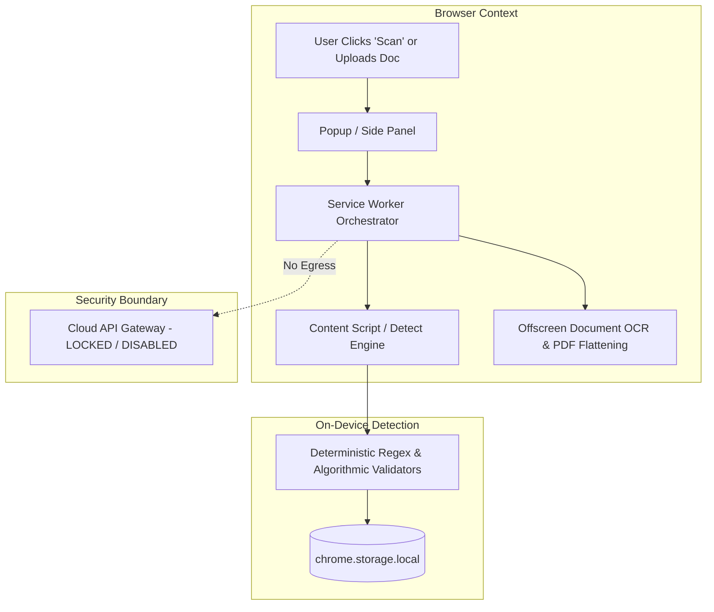
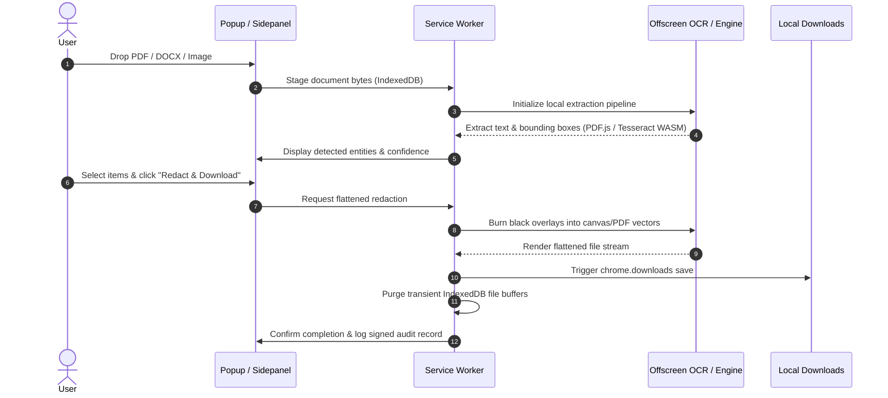

# GovernWorld Chrome Extension

[](https://github.com/ACR-LOGIC/governworld-chrome-extension/actions/workflows/ci.yml)
[](LICENSE)
[](manifest.json)
[](#local-first-architecture--privacy-guarantees)
[](https://buymeacoffee.com/governworld)

The **GovernWorld Chrome Extension** is a fully functional, local-first browser protection tool that brings GovernWorld's high-assurance detection and redaction engine directly into your web browser. It empowers users to detect, mask, and redact sensitive Personally Identifiable Information (PII), Protected Health Information (PHI), financial data, credentials, and custom patterns directly on web pages and in uploaded documents (PDF, DOCX, images) **without any data ever leaving the local device**.

---

## Table of Contents
- [Core Capabilities](#core-capabilities)
- [Local-First Architecture & Privacy Guarantees](#local-first-architecture--privacy-guarantees)
- [What Data Remains on Your Device](#what-data-remains-on-your-device)
- [Detection Categories & Compliance Presets](#detection-categories--compliance-presets)
- [Interactive Redaction Wizard](#interactive-redaction-wizard)
- [Document Processing & Redaction Workflow](#document-processing--redaction-workflow)
- [Cloud & API Status (Locked by Default)](#cloud--api-status-locked-by-default)
- [Browser Permissions & Justifications](#browser-permissions--justifications)
- [Installation & Developer Quickstart](#installation--developer-quickstart)
- [Testing & Quality Verification](#testing--quality-verification)
- [Security & Tamper Resistance](#security--tamper-resistance)
- [💛 Community Support & Sponsorship](#-community-support--sponsorship)
- [License](#license)

---

## Core Capabilities

1. **On-Demand Page Scanning & Visual Masking:**
   - Scan visible web page text on demand with a single click or keyboard shortcut (`Alt+Shift+S`).
   - Highlight detected sensitive entities and apply non-destructive, customizable visual overlays directly in the DOM.
   - Copy securely redacted plain text with sensitive values replaced by solid block placeholders `[REDACTED]`.

2. **Multi-Format Document Redaction:**
   - Drag-and-drop or select PDF, Microsoft Word (`.docx`), and image files (`.png`, `.jpg`, `.jpeg`).
   - Integrated offline OCR (Tesseract.js WebAssembly) and PDF rendering (PDF.js) running in an isolated offscreen document.
   - Download permanently flattened, redacted documents with black visual redaction blocks burnt into pixels/vectors.

3. **Interactive Redaction Wizard:**
   - Guided 4-step wizard to create custom regex, pattern, and keyword rules.
   - Live sample text test sandbox with instant validation and error detection.
   - Save custom rules to local storage for immediate application in on-page and document scanning.

4. **Dedicated In-App Instructions & Deep Linking:**
   - 10 comprehensive, built-in guide cards explaining all features and workflows.
   - Contextual help links (`data-guide`) throughout the popup and side panel interfaces that jump directly to relevant documentation sections with pulse animations.

---

## Local-First Architecture & Privacy Guarantees

GovernWorld Redaction is built from the ground up on a **100% Local-First** security model:



- **Zero Cloud Transmission:** No document contents, raw page text, or extracted sensitive values are ever sent over the network.
- **Zero Remote Code Execution:** Operates under strict Manifest V3 Content Security Policy (`script-src 'self' 'wasm-unsafe-eval'`). All scripts, WebAssembly binaries, and OCR models are bundled locally.
- **Zero Automatic Host Access:** Declares **zero `host_permissions`**. The extension cannot automatically observe or access network traffic or website origins.

---

## What Data Remains on Your Device

| Data Type | Storage Location | Persistence / Lifecycle |
| :--- | :--- | :--- |
| **User Settings & Active Preset** | `chrome.storage.local` | Retained locally until cleared by user. |
| **Custom Redaction Rules** | `chrome.storage.local` | Retained locally; managed via Redaction Wizard. |
| **Transient Scan Findings** | `chrome.storage.session` | Ephemeral; purged when browser closes. |
| **Document File Buffers** | Extension IndexedDB (`doc-pipeline`) | Transient; automatically deleted after redaction download or upon session reset. |
| **Audit Log Entries** | `chrome.storage.local` | Metadata-only (timestamps, category counts, ECDSA signatures); zero raw values stored. |

---

## Detection Categories & Compliance Presets

The engine includes deterministic, algorithmic detectors for all primary regulatory and compliance categories:

- **PII:** US SSN (structure + area validation), ITIN, passport numbers, email addresses, phone numbers, physical addresses, dates of birth.
- **Financial:** Payment card numbers (Luhn checksum validation + BIN classification), IBAN, ABA routing numbers.
- **PHI / Healthcare:** National Provider Identifiers (NPI with Luhn-check), DEA registration numbers (checksum formula validation), Medicare Beneficiary Identifiers (CMS MBI alphanumeric format), Medical Record Numbers (MRN).
- **Secrets & Credentials:** API keys, AWS access keys, JWT tokens, Bearer tokens, private SSH/RSA keys, database connection strings.
- **Custom:** User-defined rules created via the Redaction Wizard.

### Built-in Presets
- **HIPAA:** Auto-selects PHI, medical record numbers, SSN, DOB, and patient contact identifiers.
- **PCI DSS:** Auto-selects payment card numbers, card expiry, and financial account identifiers.
- **GDPR:** Auto-selects names, emails, phone numbers, addresses, and individual identification numbers.
- **Developer / Secrets:** Auto-selects API keys, private keys, auth headers, and cloud credentials.
- **Custom:** Full manual control over enabled categories and custom patterns.

---

## Interactive Redaction Wizard

The **Redaction Wizard** enables users to easily construct custom detection logic locally:

1. **Pattern Definition:** Choose between regular expressions, exact keyword lists, or prefix/suffix patterns.
2. **Category & Metadata:** Name your pattern, assign a finding category, and set a confidence weight.
3. **Interactive Test Sandbox:** Test the pattern in real time against sample test strings to verify matches, edge cases, and exclusions.
4. **Local Activation:** Save the verified rule directly into `chrome.storage.local`. The rule immediately integrates into the local detection and redaction pipeline.

---

## Document Processing & Redaction Workflow



1. **Upload:** User provides a file via the drag-and-drop zone in the side panel or popup.
2. **Local Analysis:** The document is rendered locally; OCR runs in an offscreen Web Worker using bundled Tesseract.js WASM and English language models.
3. **Review Findings:** Detected sensitive items are listed with masked previews (e.g. `phone: ***-***-1234`).
4. **Burn-in & Flattening:** Redactions are rendered directly onto the canvas or PDF vector stream using `pdf-lib`, preventing underlying text layer recovery.
5. **Download:** The redacted file is saved with `_redacted` suffix. Temporary buffers are immediately wiped.

---

## Cloud & API Status (Locked by Default)

The extension is **fully functional in standalone local mode**.

- **Disabled & Locked:** All cloud processing, remote synchronization, telemetry, and remote storage are disabled and locked by default.
- **API-Ready Architecture:** Clean client interfaces and abstraction hooks (`src/shared/settings.ts`, `src/service-worker/index.ts`) are preserved for future optional GovernWorld platform integration (e.g. centralized enterprise policy distribution).
- **Zero Accidental Egress:** The extension does not declare host permissions or transmit telemetry in this release.

---

## Browser Permissions & Justifications

Every permission requested in `manifest.json` is mapped directly to on-device functionality:

| Permission | Purpose & Justification |
| :--- | :--- |
| `activeTab` | Grants temporary access to the active tab's visible text **solely** when the user clicks "Scan this page". Never runs automatically. |
| `scripting` | Injects the local scanning content script and renders visual overlay masks in the active tab. |
| `storage` | Stores user preferences, custom wizard rules, and tamper-evident local audit records in `chrome.storage.local`. |
| `downloads` | Saves the flattened, redacted output file directly to the user's computer. |
| `offscreen` | Hosts PDF rendering and WebAssembly OCR execution without stalling the browser UI. |
| `sidePanel` | Provides a persistent side panel (`Alt+Shift+P`) for document scanning, live wizard rule creation, and in-depth instruction viewing. |
| `notifications` *(optional)* | Requested at runtime only if the user enables background completion notifications. |

---

## Installation & Developer Quickstart

### Prerequisites
- Node.js 20+
- npm 10+
- Google Chrome (or Chromium-based browser)

### Setup & Build
```bash
# Clone repository
git clone https://github.com/ACR-LOGIC/governworld-chrome-extension.git
cd governworld-chrome-extension

# Install dependencies
npm install

# Run type check and test suites
npm run typecheck
npm test

# Build production bundle to dist/
npm run build
```

### Loading the Extension in Chrome
1. Open Google Chrome and navigate to `chrome://extensions/`.
2. Enable **Developer mode** (toggle in the top-right corner).
3. Click **Load unpacked** in the top-left corner.
4. Select the `dist/` directory inside this repository.
5. Click the extension icon in your Chrome toolbar to begin scanning!

---

## Testing & Quality Verification

The codebase includes an extensive automated test suite covering all detection algorithms, redaction output integrity, wizard behavior, manifest compliance, and audit trails:

```bash
# Run all Vitest suites
npm test

# Verify offline OCR model bundling
npm run test:offline-ocr

# Typecheck TypeScript definitions
npm run typecheck
```

---

## Security & Tamper Resistance

- **Signed Audit Trail:** Every scan, mask application, document export, and policy change generates an ECDSA P-256 signed audit record stored locally.
- **Integrity Invariants:** Unit tests verify that audit logs fail closed if file downloads or delivery pipelines are intercepted.
- For vulnerability reports or security inquiries, please see [SECURITY.md](SECURITY.md).

---

## 💛 Community Support & Sponsorship

GovernWorld is **100% free, open-source, and local-only** to ensure your privacy is never compromised:
- **Zero Cloud Transmission:** All PII/PHI scanning, OCR text extraction, and document flattening happen directly on your local device.
- **Zero Data Monetization:** We never sell, log, monetize, or transmit your sensitive documents, scanned values, or browsing activity.
- **Completely Free:** Every core capability is freely accessible to everyone.

If GovernWorld saves you time or protects your sensitive workflows, you can support ongoing development, maintenance of offline models, and validator improvements:

<p align="center">
  <a href="https://buymeacoffee.com/governworld" target="_blank" rel="noopener noreferrer">
    
  </a>
</p>

You can also contribute by submitting new regex/checksum patterns, opening issues, or contributing code as outlined in [CONTRIBUTING.md](CONTRIBUTING.md).

---

## License

Copyright (c) 2026 Andres Chavez Ramirez. Licensed under the [Apache License, Version 2.0](LICENSE).
