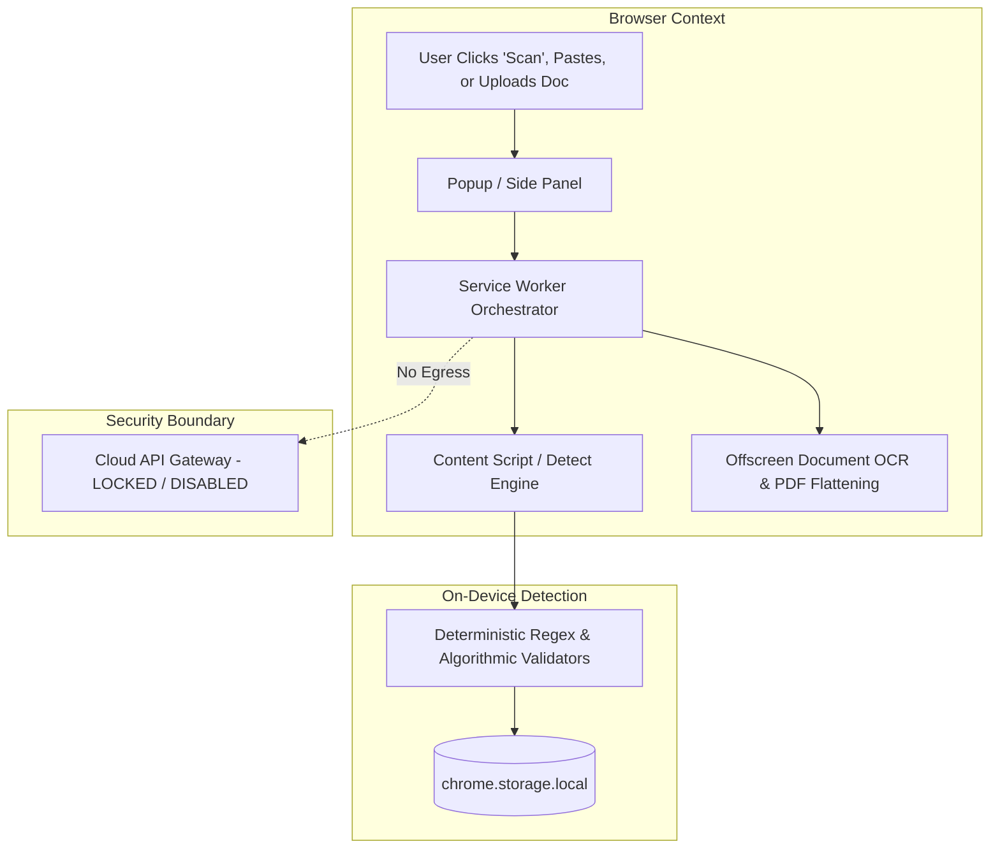
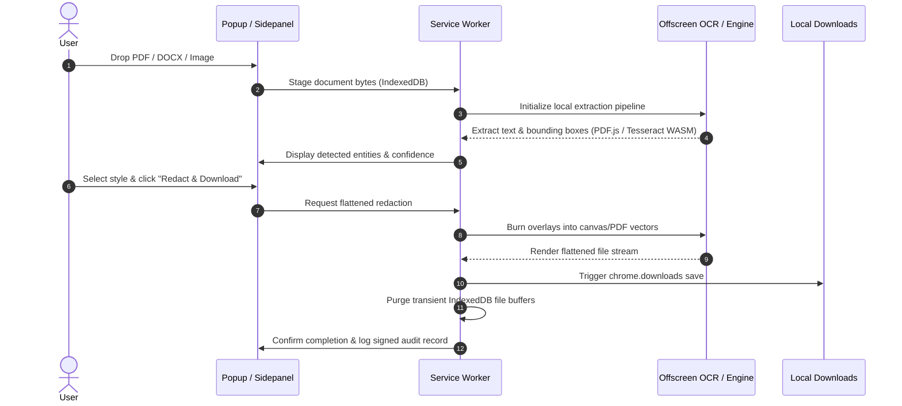

# GovernWorld Extension

[](https://github.com/ACR-LOGIC/governworld-extension/actions/workflows/ci.yml)
[](LICENSE)
[](manifest.json)
[](#local-first-architecture--privacy-guarantees)
[](#1-shipped-and-verified--chrome-and-edge)
[](https://buymeacoffee.com/governworld)
[(https://github.com/sponsors/ACR-LOGIC)

The **GovernWorld Extension** is a fully functional, local-first browser protection tool that brings GovernWorld's high-assurance detection and redaction engine directly into your web browser. It empowers users to detect, mask, and redact sensitive Personally Identifiable Information (PII), Protected Health Information (PHI), financial data, credentials, and custom patterns directly on web pages and in uploaded documents (PDF, DOCX, images). The page text and document content you scan **never leave your device** - the local pipeline has no network path at all. Optional account-linking and community features, described below, do contact GovernWorld servers, and are disabled by default.

> **Licensing:** GovernWorld Extension is source-available and free for non-commercial community use. You may inspect, modify, fork, and run the extension locally for permitted non-commercial purposes. Commercial use, redistribution, resale, hosting, bundling, or incorporation into a commercial product or service requires a separate commercial license from Andres Chavez Ramirez. See [LICENSE](LICENSE). This is not an open-source license.

---

## Table of Contents
- [Core Capabilities](#core-capabilities)
- [Browser Compatibility & Cross-Platform Installation Guide](#browser-compatibility--cross-platform-installation-guide)
  - [Google Chrome](#1-google-chrome)
  - [Microsoft Edge](#2-microsoft-edge)
  - [Mozilla Firefox](#3-mozilla-firefox)
  - [Brave Browser](#4-brave-browser)
  - [Opera & Opera GX](#5-opera--opera-gx)
  - [Vivaldi](#6-vivaldi)
  - [Arc Browser](#7-arc-browser)
  - [Apple Safari (macOS)](#8-apple-safari-macos)
- [Local-First Architecture & Privacy Guarantees](#local-first-architecture--privacy-guarantees)
- [What Data Remains on Your Device](#what-data-remains-on-your-device)
- [Detection Categories & Global Compliance Presets](#detection-categories--global-compliance-presets)
- [Accessibility & Disability Assistive Features](#accessibility--disability-assistive-features)
- [Multi-Language Internationalization (i18n)](#multi-language-internationalization-i18n)
- [Interactive Redaction Studio & Custom Styles](#interactive-redaction-studio--custom-styles)
- ["Paste & Prompt" Shield (on-demand)](#paste--prompt-shield-on-demand-chat--llm-guard)
- [Right-Click Context Menus](#right-click-context-menus)
- [Interactive Redaction Wizard](#interactive-redaction-wizard)
- [Document Processing & Redaction Workflow](#document-processing--redaction-workflow)
- [Cloud & API Status (Locked by Default)](#cloud--api-status-locked-by-default)
- [Browser Permissions & Justifications](#browser-permissions--justifications)
- [Developer Setup & Build Commands](#developer-setup--build-commands)
- [Testing & Quality Verification](#testing--quality-verification)
- [Security & Tamper Resistance](#security--tamper-resistance)
- [💛 Community Support & Sponsorship](#-community-support--sponsorship)
- [License](#license)

---

## Core Capabilities

1. **On-Demand Page Scanning & Visual Masking:**
   - Scan visible web page text on demand with a single click or keyboard shortcut (`Alt+Shift+S`).
   - Highlight detected sensitive entities and apply non-destructive visual overlays directly in the DOM.
   - Copy securely redacted plain text with sensitive values replaced by solid block placeholders `[REDACTED]`.

2. **"Paste & Prompt" Shield (on-demand, active on tabs you have activated):**
   - Intercepts paste events in real time on LLM interfaces (**ChatGPT**, **Claude**, **Gemini**, **Slack**, web forms).
   - Shows a non-intrusive floating review modal with masked previews.
   - 1-click **Sanitize & Paste** automatically scrubs secrets/PII before pasting.

3. **Interactive Document Redaction Studio:**
   - Drag-and-drop or select PDF, Microsoft Word (`.docx`), and image files (`.png`, `.jpg`, `.webp`).
   - Interactive canvas: click finding boxes to toggle or drag with mouse to draw custom redaction boxes.
   - Multiple Redaction Styles: **Solid Blackout**, **Clean Whiteout**, or **Compliance Text Stamp** (e.g. `[CONFIDENTIAL]`).
   - OCR via a self-contained pipeline that reads bundled language data offline. This build bundles English only; the language list, the build, and the selector share one source of truth (`src/shared/ocrLanguages.ts`) so an unbundled language can never be offered.

4. **Multi-Language UI Internationalization (i18n):**
   - Dynamic interface translation for **English**, **Spanish**, **French**, **German**, **Japanese**, **Portuguese**, and **Simplified Chinese**.
   - Switch languages instantly in Settings; persisted in local storage.

5. **Accessibility & Assistive Features (WCAG AAA):**
   - **Font Scaling:** Standard (100%), Medium (115%), Large (130%), and Extra Large (150% for low vision).
   - **High Contrast Mode:** Pure black backgrounds, cyan accents, and high-visibility 2px white borders.
   - **Dyslexia-Friendly Spacing:** Expanded letter-spacing, line-height, and readability fonts.
   - **Screen Reader Voice Assistance:** Web Speech API announces findings, counts, and actions aloud for blind users.

6. **Global Compliance Presets & International Validators:**
   - Built-in checksum validators for Canadian SIN, UK NHS, Indian Aadhaar (Verhoeff) & PAN, Australian TFN, Brazilian CPF, LOINC, and Securities CUSIP/ISIN.
   - 1-click presets: HIPAA, PCI DSS, GDPR, PIPEDA, UK GDPR/NHS, India DPDP, Australia Privacy, Brazil LGPD, Developer.

7. **Right-Click Context Menu Protection:**
   - Highlight any text and right-click to *Redact selection to clipboard* or *Mask selection* without opening the popup.

---

## Browser Compatibility & Cross-Platform Installation Guide

GovernWorld is engineered to conform to the **W3C WebExtensions Manifest V3 specification** and runs seamlessly across all modern desktop web browsers.

```
| Browser | Status | Notes |
|---|---|---|
| Chrome 116+ | **Shipped and verified** | Manifest V3. The build target; every automated gate runs against it. |
| Edge 116+ | **Shipped and verified** | Chromium-based; same MV3 build as Chrome. |
| Brave, Opera, Vivaldi, Arc | Supported, unverified | Chromium-based and load the same unpacked build. Not covered by the automated gates, so treat as untested rather than confirmed. |
| Firefox 109+ | **Packaged (`npm run build:firefox`)** | Own MV3 manifest (`manifest.firefox.json`), locked add-on id, sidebar panel. Page protection, paste guard, and scanning ship; Document Studio needs an offscreen-capable runtime, so document jobs report an explicit error where it is absent. Browser-run QA pending — see `BROWSER_SUPPORT.md`. |
| Safari | **Payload only, not distributable from here** | `npm run build:safari` produces the web-extension file set; packaging it into a signed app requires a Mac with Xcode (`xcrun safari-web-extension-packager`) or App Store Connect (Apple Developer Program). No distributable Safari artifact is claimed. |
```

### Build the Package First
Before loading into any browser, build the production bundle:
```bash
git clone https://github.com/ACR-LOGIC/governworld-extension.git
cd governworld-chrome-extension
npm install
npm run build
```
This outputs the packaged extension into the `dist/` directory.

---

### 1. Google Chrome
1. Open Google Chrome and navigate to `chrome://extensions/`.
2. Turn ON the **Developer mode** toggle in the top-right corner.
3. Click the **Load unpacked** button in the top-left corner.
4. Select the `dist/` folder inside the cloned repository.
5. Click the puzzle icon in the Chrome toolbar and pin **GovernWorld** for quick access.

---

### 2. Microsoft Edge
1. Open Microsoft Edge and navigate to `edge://extensions/`.
2. In the left-hand sidebar, enable the **Developer mode** toggle.
3. Click **Load unpacked** at the top of the page.
4. Select the `dist/` folder from this repository.
5. Click the extension icon in the Edge toolbar to start protecting pages!

---

### 3. Mozilla Firefox
`manifest.firefox.json` is the Firefox MV3 manifest (own locked add-on id,
event-page background, `sidebar_action` panel) packaged by
`npm run build:firefox` into `dist-firefox/`. Page scanning, paste protection,
and masks ship; the Document Studio reports an explicit error on runtimes
without the offscreen API instead of failing silently.

#### Temporary / Developer Installation:
1. Open Firefox and navigate to `about:debugging#/runtime/this-firefox`.
2. Click the **Load Temporary Add-on...** button.
3. Navigate to the `dist-firefox/` directory and select `manifest.json`.
4. The GovernWorld shield icon will appear in your Firefox toolbar.

#### Persistent Unbranded / Developer Edition Installation:
- Pack `dist-firefox/` into a `.zip` file, rename to `.xpi`, and install via `about:addons` > **Install Add-on From File...**.

---

### 4. Brave Browser
1. Open Brave and navigate to `brave://extensions/`.
2. Toggle ON **Developer mode** in the top-right corner.
3. Click **Load unpacked** in the top-left corner.
4. Select the `dist/` directory.
5. Pin the GovernWorld extension in the Brave toolbar.

---

### 5. Opera & Opera GX
1. Open Opera and navigate to `opera://extensions/`.
2. Toggle ON **Developer mode** in the top-right corner.
3. Click **Load unpacked extension**.
4. Select the `dist/` folder.
5. Pin the extension in your Opera toolbar.

---

### 6. Vivaldi
1. Open Vivaldi and navigate to `vivaldi://extensions/`.
2. Enable **Developer mode** (top-right toggle).
3. Click **Load unpacked** and choose the `dist/` directory.

---

### 7. Arc Browser
1. Open Arc and press <kbd>Cmd</kbd>+<kbd>,</kbd> (or <kbd>Ctrl</kbd>+<kbd>,</kbd> on Windows) to open **Settings**.
2. Go to **Extensions** > click **Open Extensions Page** (or navigate to `arc://extensions/`).
3. Turn ON **Developer mode**.
4. Click **Load unpacked** and select the `dist/` folder.

---

### 8. Apple Safari (macOS) — packaging requires Apple tooling
Safari cannot load a Chrome extension directly. `npm run build:safari`
produces the web-extension file set in `dist-safari/`; turning it into an
installable Safari extension requires packaging it as an app — either with
Xcode on a Mac or through App Store Connect (Apple Developer Program) — which
is unavailable on this build machine. No distributable Safari artifact is
claimed; see `BROWSER_SUPPORT.md` for the exact blocker and commands.

With Xcode installed, the packaging step is:

1. Ensure Xcode is installed with Command Line Tools:
   ```bash
   xcode-select --install
   ```
2. Package the built payload (note: the current tool is
   `safari-web-extension-packager`, the renamed `safari-web-extension-converter`):
   ```bash
   xcrun safari-web-extension-packager /path/to/governworld-chrome-extension/dist-safari --project-location /path/to/output --app-name "GovernWorld"
   ```
3. Open the generated Xcode project and click **Run** to build the macOS container app.
4. In Safari, go to **Settings** > **Advanced** > check **"Show features for web developers"**.
5. Go to **Develop** menu > check **"Allow Unsigned Extensions"**.
6. In **Safari Settings** > **Extensions**, enable **GovernWorld**.

A Safari web extension governs supported activity inside Safari only — not
iMessage, native apps, or the OS.

---

## Local-First Architecture & Privacy Guarantees

GovernWorld Redaction is built from the ground up on a **local-processing-by-default** security model:



- **Zero Cloud Transmission:** No document contents, raw page text, or extracted sensitive values are ever sent over the network.
- **Zero Remote Code Execution:** Strict Manifest V3 Content Security Policy (`script-src 'self' 'wasm-unsafe-eval'`). All scripts, WebAssembly binaries, and OCR models are bundled locally.
- **Zero Automatic Host Access:** Declares **zero `host_permissions`**. The extension cannot automatically observe or access network traffic or website origins.

---

## What Data Remains on Your Device

| Data Type | Storage Location | Persistence / Lifecycle |
| :--- | :--- | :--- |
| **User Settings & Active Preset** | `chrome.storage.local` | Retained locally until cleared by user. |
| **Custom Redaction Rules** | `chrome.storage.local` | Retained locally; managed via Redaction Wizard. |
| **Transient Scan Findings** | `chrome.storage.session` | Ephemeral; purged when browser closes. |
| **Document File Buffers** | Extension IndexedDB (`governworld-redaction`) | Transient; automatically deleted after redaction download or session reset. |
| **Audit Log Entries** | `chrome.storage.local` | Metadata-only (timestamps, category counts, ECDSA signatures); zero raw values stored. |

---

## Detection Categories & Global Compliance Presets

The engine includes deterministic, algorithmic detectors for all primary regulatory and compliance categories:

- **PII:** US SSN, ITIN, passport numbers, email addresses, phone numbers, physical addresses, dates of birth.
- **Financial:** Payment card numbers (Luhn checksum validation + BIN classification), IBAN, ABA routing numbers.
- **PHI / Healthcare:** National Provider Identifiers (NPI checksum), DEA registration numbers, Medicare Beneficiary Identifiers (CMS MBI), Medical Record Numbers (MRN), LOINC codes.
- **International Identifiers:** Canadian SIN (Luhn check), UK NHS Number (Mod-11 check), Indian Aadhaar (Verhoeff check) & PAN, Australian TFN (Mod-11 check), Brazilian CPF (Dual checksum).
- **Secrets & Credentials:** API keys, AWS access keys, JWT tokens, Bearer tokens, private SSH/RSA keys, database connection strings.
- **Custom:** User-defined rules created via the Redaction Wizard.

### Built-in Global Compliance Presets
- **HIPAA:** Auto-selects PHI, medical record numbers, SSN, DOB, and patient contact identifiers.
- **PCI DSS:** Auto-selects payment card numbers, card expiry, and financial account identifiers.
- **GDPR:** Auto-selects names, emails, phone numbers, addresses, and individual identification numbers.
- **PIPEDA:** Auto-selects Canadian SIN and personal data.
- **UK GDPR / NHS:** Auto-selects UK NHS numbers and health records.
- **India DPDP Act:** Auto-selects Aadhaar, PAN card, and identity identifiers.
- **Australia Privacy Act:** Auto-selects Tax File Numbers (TFN) and personal identifiers.
- **Brazil LGPD:** Auto-selects Brazilian CPF numbers and personal records.
- **Developer / Secrets:** Auto-selects API keys, private keys, auth headers, and cloud credentials.
- **Custom:** Full manual control over enabled categories and custom patterns.

---

## Accessibility & Disability Assistive Features

GovernWorld is designed to be accessible to all users, including those who are blind, low-vision, or have dyslexia:

- **Font Size & Visual Scaler:** Choose from `Default (100%)`, `Medium (115%)`, `Large (130%)`, or `Extra Large (150%)`.
- **High Contrast Mode:** Pure black backgrounds, cyan accents, and bold borders.
- **Dyslexia-Friendly Mode:** Expanded letter spacing, line height, and high-readability text formatting.
- **Reduced Motion:** Disables animations and sliding transitions for users sensitive to motion.
- **Screen Reader Voice Announcements:** Uses the standard Web Speech API (`speechSynthesis`) and ARIA live regions (`role="status"`, `aria-live="polite"`) to announce scan findings, counts, and download actions.
- **Verbose ARIA Mode:** Extends accessible descriptions for full keyboard navigation and NVDA/JAWS/VoiceOver compatibility.

---

## Multi-Language Internationalization (i18n)

The extension interface dynamically translates across 7 languages with instant switching and local persistence:
- 🇺🇸 **English** (`en`)
- 🇪🇸 **Español** (`es` - Spanish)
- 🇫🇷 **Français** (`fr` - French)
- 🇩🇪 **Deutsch** (`de` - German)
- 🇯🇵 **日本語** (`ja` - Japanese)
- 🇵🇹 **Português** (`pt` - Portuguese)
- 🇨🇳 **简体中文** (`zh` - Simplified Chinese)

---

## Interactive Redaction Studio & Custom Styles

The **Document Redaction Studio** provides an interactive canvas interface:
- **Draw Custom Boxes:** Click and drag to draw arbitrary redaction boxes on any page.
- **Toggle Findings:** Click any detected finding box to include or exclude it from redaction.
- **Redaction Styles:**
  - **Blackout:** Solid opaque black rectangles (forensic and legal standard).
  - **Whiteout:** Clean solid white fill.
  - **Text Stamp:** Centered compliance text labels (e.g. `[REDACTED]`, `[CONFIDENTIAL]`, `[PHI REMOVED]`).
- **Flattening:** Output files are permanently flattened in memory, preventing recovery of underlying layers.

---

## "Paste & Prompt" Shield (Chat & input guard)

Guards against pasting credentials, PHI, or PII into any browser input —
AI chats, web forms, SaaS apps, rich-text editors — not a list of AI
companies. Provider names may appear in the UI to orient you, but enforcement
keys off editable surfaces, so an unknown AI clone on an unlisted hostname is
covered exactly like a known one:
- Intercepts `paste`, `beforeinput`, and drag-and-drop text on `input`,
  `textarea`, and `[contenteditable]` elements, including editors inside open
  shadow roots and same-origin iframes.
- Displays a floating Shadow DOM review modal near the input.
- Actions: **Sanitize & Paste** (replaces secrets with `[REDACTED]`), **Paste Unchanged**, or **Cancel** (<kbd>Esc</kbd>).
- Interception happens synchronously before insertion: a blocked or sanitized
  paste never reaches the destination. A dialog fault inserts nothing.

### Protection modes — what is active, and when

| Mode | Meaning |
|---|---|
| Off | No paste interception. Explicit scans and redaction still work. |
| This tab (default) | Pastes are guarded in tabs you explicitly authorize by opening GovernWorld there. Needs no site access. |
| Always on | Guarded on every site you visit — only after you grant site access in the browser prompt. Revoking the grant stops coverage. |

The practical consequence, stated plainly:

| Situation | Guard active? |
|---|---|
| This-tab mode, you opened GovernWorld on the chat site, then paste | Yes |
| This-tab mode, you invoked a GovernWorld shortcut or context-menu action on the tab, then paste | Yes |
| This-tab mode, you open a chat site in a new tab and paste without touching GovernWorld first | **No** |
| Always-on mode with site access granted, any site, new tabs and restarts included | Yes |
| Always-on selected but site access denied or revoked | **No** — the UI says it is waiting for access, never that it is active |
| You close or reload a tab (this-tab mode) and paste again | **No**, until you activate GovernWorld on that tab again |

This-tab is the default because the extension installs with no install-time
host permissions: it has no presence in a tab until the user acts on it. The
content script is injected on demand (via an `activeTab` grant from the
toolbar action, the context menu, or the keyboard shortcut). Always-on is the
explicit opt-in for standing access — requested at runtime as optional
`http://*/*` + `https://*/*` origins (never the `<all_urls>` blanket), and
revocable at any time. See [PERMISSIONS.md](PERMISSIONS.md) for what is
requested and why, and `BROWSER_SUPPORT.md` for per-browser coverage.

---

## Right-Click Context Menus

GovernWorld integrates directly into the browser right-click context menu:
- **Redact selection to clipboard:** Copies highlighted text with sensitive data masked.
- **Mask selected text / element:** Immediately overlays visual privacy masks on the page.
- **Scan whole page:** Triggers instant on-device scan (<kbd>Alt</kbd>+<kbd>Shift</kbd>+<kbd>S</kbd>).

---

## Interactive Redaction Wizard

The **Redaction Wizard** enables users to construct custom detection logic locally:
1. **Examples:** Provide positive match examples and negative exclusion examples.
2. **Analysis:** Generates candidate regex patterns locally using sample text.
3. **Sandbox Test:** Test candidate patterns against interactive sample text in real time.
4. **Save Locally:** Save rules directly into `chrome.storage.local` for immediate use in scans and document redactions.

---

## Document Processing & Redaction Workflow



---

## Cloud & API Status (Locked by Default)

The extension is **fully functional in standalone local mode**.
- **Disabled & Locked:** All cloud processing, remote synchronization, telemetry, and remote storage are disabled and locked by default.
- **API-Ready Architecture:** Clean client interfaces and abstraction hooks (`src/shared/settings.ts`, `src/service-worker/index.ts`) are preserved for future optional GovernWorld platform integration.
- **Zero Accidental Egress:** The extension does not declare host permissions or transmit telemetry.

---

## Browser Permissions & Justifications

| Permission | Purpose & Justification |
| :--- | :--- |
| `activeTab` | Grants temporary access to the active tab's visible text **solely** when the user clicks "Scan Page". Never runs automatically. |
| `scripting` | Injects the local scanning content script and renders visual overlay masks in the active tab. |
| `storage` | Stores user preferences, custom wizard rules, and local audit records in `chrome.storage.local`. Exported logs are signed. |
| `downloads` | Saves the flattened, redacted output file directly to the user's computer. |
| `offscreen` | Hosts PDF rendering and WebAssembly OCR execution without stalling the browser UI. |
| `sidePanel` | Provides a persistent side panel (`Alt+Shift+P`) for document scanning, live wizard rule creation, and in-depth instruction viewing. |
| `contextMenus` | Adds right-click shortcuts (*Redact selection*, *Mask element*, *Scan page*). |
| `notifications` *(optional)* | Requested at runtime only if the user enables background completion notifications. |

---

## Developer Setup & Build Commands

### Prerequisites
- Node.js 20+
- npm 10+

### Build Commands
```bash
# Clone repository
git clone https://github.com/ACR-LOGIC/governworld-extension.git
cd governworld-chrome-extension

# Install dependencies
npm install

# Typecheck TypeScript sources
npm run typecheck

# Run the full Vitest suite (count and current result: see the CI badge above)
npm test

# Run browser verification & Chromium E2E tests
npm run verify:browser

# Build production bundle to dist/
npm run build
```

---

## Testing & Quality Verification

The codebase includes an extensive automated test suite covering all detection algorithms, redaction output integrity, wizard behavior, manifest compliance, and audit trails:

- **Unit & Integration Tests:** the full Vitest suite via `npm test`, with the current pass count reported by the CI badge above. Counts are not hard-coded here on purpose - a stale number in a README is worse than no number.
- **Browser Automation Verification:** Real Chromium browser validation (`npm run verify:browser`).
- **Photo OCR & Coordinate Mapping E2E:** End-to-end verification of document OCR, coordinate mapping, and pixel flattening (`npm run test:photo-e2e`).
- **Cross-Browser Verification:** Tests verifying compatibility across Chrome, Edge, Firefox, Safari, and Brave (`tests/cross-browser-compatibility.test.ts`).

---

## Security & Tamper Resistance

- **Signed Audit Trail:** Every scan, mask application, document export, and policy change generates an ECDSA P-256 signed audit record stored locally.
- **Integrity Invariants:** Unit tests verify that audit logs fail closed if file downloads or delivery pipelines are intercepted.
- For vulnerability reports or security inquiries, please see [SECURITY.md](SECURITY.md).

---

## 💛 Community Support & Sponsorship

GovernWorld is **free for non-commercial use, source-available, and local-only** to ensure your privacy is never compromised:
- **Zero Cloud Transmission:** All PII/PHI scanning, OCR text extraction, and document flattening happen directly on your local device.
- **Zero Data Monetization:** We never sell, log, monetize, or transmit your sensitive documents, scanned values, or browsing activity.
- **Free for Community Use:** Every core capability is freely accessible for personal, educational, research, and other non-commercial purposes.

If GovernWorld saves you time or protects your sensitive workflows, you can support ongoing development, maintenance of offline models, and validator improvements:

<p align="center">
  <a href="https://buymeacoffee.com/governworld" target="_blank" rel="noopener noreferrer">
    
  </a>
</p>

You can also contribute by submitting new regex/checksum patterns, opening issues, or contributing code as outlined in [CONTRIBUTING.md](CONTRIBUTING.md).

---

## License

Copyright (c) 2026 Andres Chavez Ramirez. All rights reserved.

GovernWorld Extension is **source-available** under the [GovernWorld Source-Available Community License](LICENSE): free for non-commercial community use. You may inspect, modify, fork, and run the extension locally for permitted non-commercial purposes. Commercial use, redistribution, resale, hosting, bundling, or incorporation into a commercial product or service requires a separate commercial license from Andres Chavez Ramirez. This is not an open-source (OSI-approved) license.
